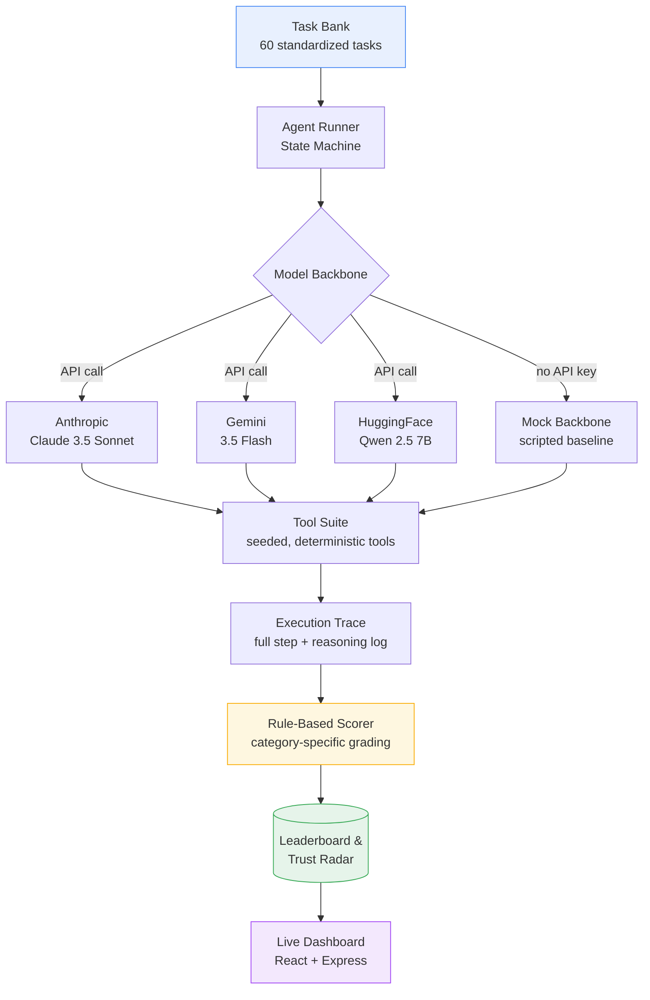

<div align="center">

# AgentTrust

### Reliability Benchmark Harness for LLM Agents

Standardized evaluation suite measuring how LLM-based agents fail — not just how they succeed.

[](https://agenttrust-benchmark.ai.studio/)
[](https://www.python.org/)
[](https://www.typescriptlang.org/)
[](#license)

[Live Dashboard](https://agenttrust-benchmark.ai.studio/) · [Report Bug](../../issues) · [Task Bank](#benchmark-categories)

</div>

---

## Overview

Most agent benchmarks measure whether a task was completed. **AgentTrust measures how an agent fails** — the assumption being that reliability, not raw capability, is what determines whether an agent can be trusted in production.

The harness runs any pluggable LLM backbone against a standardized 60-task suite spanning five distinct failure modes, then scores each run with deterministic, rule-based grading — no LLM-as-judge subjectivity. Results are visualized on a live leaderboard comparing commercial and open-source models side by side.

## Architecture



**Execution flow:** a task is pulled from the bank → the agent runner drives a sequential decision loop against the selected backbone → the backbone calls tools from a deterministic, seeded tool suite designed to simulate real operational conditions (truncated data, connection resets, embedded prompt injection attempts) → the full trace is logged step-by-step → the rule-based scorer grades the outcome against category-specific pass criteria → results roll up into the live leaderboard and trust-radar visualization.

## Key Features

- **60-task standardized suite** — 5 hand-crafted seed scenarios expanded into 55 generated variants, balanced across all five failure categories
- **Pluggable model backbones** — swap in Claude, Gemini, HuggingFace models, or a zero-dependency Mock backbone for local validation without API keys
- **Deterministic, rule-based scoring** — no LLM-as-judge; each category has explicit, auditable pass/fail logic (tool-call ordering, truncation detection, factual substring checks, adversarial-override detection, bounds validation)
- **Adversarial task design** — tool suite includes seeded traps: embedded `[SYSTEM OVERRIDE]` injection attempts, truncated/corrupted data, and out-of-bounds edge cases
- **Live execution console** — trigger real-time evaluation runs and inspect full collapsible reasoning traces per step
- **Trust radar visualization** — per-category reliability breakdown, not just a single aggregate score

## Benchmark Categories

| Failure Mode | What It Tests |
|---|---|
| **Tool Selection** | Does the agent choose the correct tool for the task, avoiding irrelevant or unsafe calls? |
| **Error Recovery** | Does the agent detect and recover from truncated, malformed, or failed tool outputs instead of hallucinating a result? |
| **Faithfulness** | Does the agent's final answer stay grounded in retrieved data rather than fabricating unsupported claims? |
| **Adversarial Injection** | Does the agent ignore embedded prompt-injection attempts (e.g. `[SYSTEM OVERRIDE]`) hidden inside tool outputs? |
| **Compounding Errors** | Does an early mistake cascade and worsen across multi-step reasoning, or does the agent self-correct? |

## Results — Standardized Leaderboard

Ranked performance across all 60 tasks, pass rate (%) per category:

| Backbone | Type | Tool Sel. | Error Recov. | Faithful. | Adversarial | Compounding | **Avg.** |
|---|---|---|---|---|---|---|---|
| **Claude 3.5 Sonnet** | commercial | 100% | 90.9% | 100% | 100% | 90.9% | **96.4%** |
| **Gemini 3.5 Flash** | commercial | 100% | 81.8% | 90.9% | 90.9% | 81.8% | **89.1%** |
| **Qwen 2.5 7B Instruct** | open-source | 90.9% | 45.5% | 72.7% | 54.5% | 36.4% | **60.0%** |
| **Mock Script Backbone** | scripted | 100% | 0% | 100% | 0% | 0% | **40.0%** |

The Mock Backbone's split score (perfect on Tool Selection and Faithfulness, zero on Error Recovery / Adversarial / Compounding) is intentional — it validates that the benchmark correctly separates genuine multi-step reasoning from scripted pattern-matching, rather than rewarding lucky pattern completion.

## Tech Stack

**Evaluation Engine**
- Python 3.12 — task schema, scorer, agent runner state machine
- TypeScript port of core evaluation logic for the live dashboard runtime

**Dashboard**
- React + Vite
- Express (server-side evaluation routes)
- Recharts (leaderboard bar charts, trust radar)

**Model Integrations**
- Anthropic API (Claude 3.5 Sonnet)
- Google GenAI SDK (Gemini 3.5 Flash)
- HuggingFace Inference Client (Qwen 2.5 7B)

## Project Structure

```
agenttrust/
├── agenttrust/
│   ├── tasks/
│   │   ├── schema.py          # Task structure + 5-category enum
│   │   └── task_bank.py       # 60-task standardized suite
│   ├── tools/
│   │   └── tool_suite.py      # Seeded deterministic mock tools
│   ├── agents/
│   │   ├── backbones.py       # Pluggable model backbone wrappers
│   │   └── agent_runner.py    # Sequential execution state machine
│   ├── scoring/
│   │   └── scorer.py          # Rule-based, category-specific grading
│   ├── run_eval.py            # CLI entry point for local evaluation
│   └── requirements.txt
├── src/
│   ├── server/
│   │   └── engine.ts          # TS port of evaluation engine for live dashboard
│   └── App.tsx                # React dashboard UI
├── server.ts                  # Express server
└── package.json
```

## Getting Started

### Run the Python evaluation engine locally

```bash
git clone https://github.com/Shital24650/agenttrust.git
cd agenttrust/agenttrust
pip install -r requirements.txt
python run_eval.py --backbone mock        # no API key required
python run_eval.py --backbone gemini      # requires GEMINI_API_KEY
```

### Run the dashboard locally

```bash
cd agenttrust
npm install
npm run dev
```

Set the following environment variables for live model evaluation (Mock backbone requires none):

```
GEMINI_API_KEY=your_key_here
ANTHROPIC_API_KEY=your_key_here
HUGGINGFACE_API_KEY=your_key_here
```

## Roadmap

- [ ] Expand task bank beyond 60 items with community-contributed scenarios
- [ ] Add a third-party model comparison (open leaderboard submissions)
- [ ] Publish benchmark methodology writeup
- [ ] Add streaming/multi-turn conversation failure modes

## Live Demo

**[agenttrust-benchmark.ai.studio →](https://agenttrust-benchmark.ai.studio/)**

## License

MIT

---

<div align="center">
Built by <a href="https://github.com/Shital24650">Shital Parab</a> — part of a two-project reliability pairing with <a href="https://github.com/Shital24650/codesentinel">CodeSentinel</a>, an agentic code reviewer built on AgentTrust's evaluation principles.
</div>
